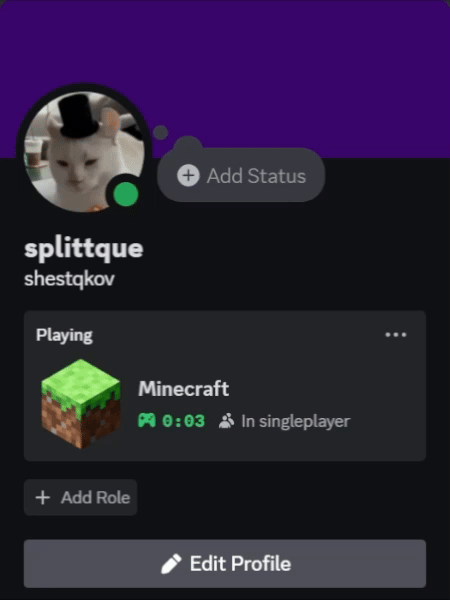

# Presencium
This is a simple mod that shows in Discord the status of minecraft with prepared states.
All languages that are represented in Discord are supported. For Fabric and Forge.

### Credits

- [discord-game-sdk4j](https://github.com/JnCrMx/discord-game-sdk4j) (used for discord rich presence)

### Build
Project uses **gradle 8.8** and **java 21**

1. Download and open project
2. Change the code

_for common:_

3. Clean with task **clean** _**(gradlew :common:clean)**_
4. Build with task **build** _**(gradlew :common:build)**_

_for fabric:_

3. Clean with task **clean** _**(gradlew :fabric:clean)**_
4. Test with task **runClient** _**(gradlew :fabric:runClient)**_
5. Build with task **build** _**(gradlew :fabric:build)**_

_for forge:_

3. Clean with task **clean** _**(gradlew :forge:clean)**_
4. Test with task **runClient** _**(gradlew :forge:runClient)**_
5. Build with task **jarJar** _**(gradlew :forge:jarJar)**_